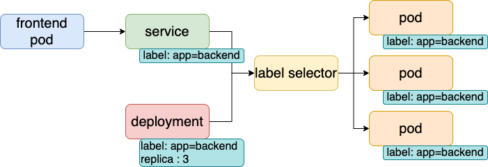

# 创建和发布应用

## deployment

是 RC 的升级版,最大的特点是我们可以随时知道当前 pod 的部署进度.即一个 pod 创建、调度、绑定节点、在目标 node 上启动对应容器的部署过程.

### 使用场景

1. 创建 deployment 对象来生成对应 Replica Set 并完成 pod 副本创建
2. 检查 deployment 的状态来看部署是否完成(pod 副本数量是否达到预期值)
3. 更新 deployment 以创建新的 pod (如镜像升级)
4. 如果当前 deployment 不稳定,则回滚到一个早先的 deloyment 版本
5. 暂停 deployment 以便一次修改多个 podtemplatespec 配置,之后再恢复,进行新的发布

### deployment.yaml

```yaml
apiversion: extensions/vlbetal
kind: Deployment
metadata:
	name: frontend
spec:
	replicas: 1
	selector:
	matchlabels:
		tier: frontend
	matchexpressions
		-	{key: tier, operator: In, values: [frontend])
	template:
		metadata
		labels:
			app: app-demo
			tier: frontend
		spec
			containers
			-	name: tomcat-demo
				mage: tomcat
				imagePullPolicy: IfNotPresent
				ports:
				-	containerport: 8080
```

### 创建 deployment

```shell
kubectl create -f deployment.yaml # 创建
kubectl get deployment # 查看
kubectl describe deployments # 清楚的看到 deployment 控制 pod 的水平扩张过程
kubectl get rs # 查看 Relica Set
```

get 结果 :

| 列         | 含义                                                         |
| ---------- | ------------------------------------------------------------ |
| DESIRED    | pod 副本数量的期望值,即 Replica                              |
| CURRENT    | 当前 Relica 值,当前 pod 副本数                               |
| UP-TO-DATE | 最新版本的 pod 副本数量,指示滚动升级过程中有多少个 pod 副本已经成功升级 |
| AVAILABLE  | 当前集群中可用 pod 副本数量,即集群中当前存活的 pod 副本数量  |

## statefulset

可以看作 deployment/RC 的变种:

1. 每个 pod 都有稳定、唯一网络标识用来发现集群内其它成员,假设名称为 kafka,那么第一个叫 kafka-0,第二个叫 kafka-1

2. 控制的 pod 副本启动顺序是受控制的

3. 除了与 pv 卷捆绑以存储 pod 状态数据,还要使用 headless service,headless service 没有 cluster ip,解析 dns 域名返回全部 pod 的 endpoint 列表.为每个 pod 实例创建一个 DNS 域名.

   ```shell
   $(podname).$(headless service name) # kafka-0.kafka、kafka-1.kafka
   ```

## mysql-rc.yaml

Replica Set 与 Deployment 两个重要的资源对象正在逐步取代 RC.

Replication Controller (1.2 版本后叫做 Replica Set ) 定义一个期望场景,声明某个 pod 副本数量在任意时刻都符合某个预期的值.通过 RC 实现用户集群的高可用,包括以下几个部分

1. pod 期待副本数
2. 用于筛选目标 pod 的 label selector
3. 当副本数量小于预期数量时,用于创建新 pod 的 pod 模版 ( template )

```yaml
apiVersion: v1
kind: RepicationController # 副本控制器
metadata:
	name: mysql # rc 名称,全局唯一
spec:
	replicas: 1 # 期待 pod 副本数
	selector:
		app: mysql # 监控和管理有这些标签的 pod 实例
	template:
		metadata:
			labels:
				app: app-demo
				tier: frontend
		spec:
			containers
			- name: tomcat-demo
				lmage: tomcat
				imagePullPolicy: IfNotPresent
			env
			-	name: GET_HOSTS_FROM
				value: dns
			ports:
			-	containerport: 80
```

### 动态修改副本数量

```shell
kubectl scale rc redis-slave --replicas=3
```

删除 RC 不会影响通过该 RC 已经创建好的 pod,为了删除所有 pod,可以设置 replicas 为 0,然后更新该 RC. kubectl 提供 stop 和 delete 命令来一次删除 RC 和 RC 控制的全部 pod

## 发布到集群

```shell
kubectl create -f rc.yaml # 创建
kubectl get rc # 查看创建的 rc
kubectl get pods # 查看 pod 创建情况, pod 创建时间较长时状态从 pending -> running
```

## mysql-svc.yaml

```yaml
apiverslon: v1
kind: Service #表明是 Kubernetes Service
metadata:
	name: mysql # Service 的全局唯一名称
spec:
 	ports:
 		- port: 3306 # Service 提供服务的端口号
 	selector: # Service 对应的 Pod 拥有这里定义的标签
 		app: mysql
  env:            # 注入环境变量
  	-name : E
  	 value : a
```

### service 多端口

有些服务一个端口提供业务服务,一个端口提供管理服务,要求每个 endpoint 都有一个名称来区分

```yaml
Ports:
	-	port: 8080
		name: service-port
	-	port:	8005
		name: shutdown-port
```

### DNS 系统

实现服务发现.

### ip

1. node ip : k8s 之外的节点访问访问集群内服务时必须通过 node ip 通信.
2. pod ip : 是 docker engine 根据 docker0 网桥 ip 地址段进行分配的,是一个虚拟的二层网络,一个 pod 里的容器访问另一个 pod 里的容器时通过 pod ip 所在的二层网络进行通信.真实的 tcp/ip 流量通过 node ip 物理网卡流出
3. cluster ip 虚拟 ip,像一个伪造的 ip 网络
   * 仅作用于 service 这个对象,由 k8s 管理和分配
   * 无法被 ping,因为没有一个实体网络对象来相应
   * 只能和 service port 组成一个具体通信端口,属于内部地址,无法外部直接使用

采用 nodeport 提供外部应用访问入口:

```yaml
spec:
	type: NodePort
	ports:
		-	port: 8080
			nodeport: 31002
```

nodeport 解决外部访问问题,但是没解决负载均衡,需要单独部署.HAProxy 或 Nginx.

## 创建 service

```shell
kubectl create -f mysql-svc.yaml # 创建 service
kubectl get svc # 查看创建的 service
kubectl get svc mysql -o yaml # 查看服务 yaml 文件
```

cluster ip 是服务创建后系统自动分配的,pod 无法预先知道某个 service 的 cluster ip,因此需要服务发现机制来找到这个服务.k8s使用环境变量来解决这个问题,容器可以从环境变量中获取 service 对应的 cluster IP 和端口,从而发起 tcp/ip 连接请求.



## app.yaml

应用容器内使用环境变量 MYSQL_SERVICE_HOST 的值连接 mysql 服务,更安全可靠的方法是应用服务的名称.

```yaml
type : NodePort
nodePort :30001
```

此 service 开启 nodeport 外网访问模式,集群之外可以通过 nodePort 访问服务.

```shell
kubectl get services
```

## 滚动升级

## HPA-横向自动扩容

### 负载度量指标

1. CPUUtilizationPercentage : 目标 pod 所有副本自身 cpu 利用率的平均值,一个 pod 自身的 cpu 使用率是该 pod 当前 cpu 使用量除以他的 pod request 的值.如果目标没有定义 pod Request 无法使用该值实现横向自动扩容.该值超过 80% 会自动扩容,高峰过去后 cpu 利用率降下来 pod 副本数将少到合理水平.计算过程通常是 1min 钟的平均值,痛殴查询 heapster 监控子系统得到这个值需要安装部署 heapster.从 1.7 版本后 k8s 自身孵化了一个基础性能数据采集监控框架 Kubernetes Monitoring Architecture.
2. 应用程序自定义度量指标(如 qps、tps)

```yaml
# 控制一个目标对象名为 php-apache 的 deloyment 里 pod 副本数,当 Cpuutilizationpercentage 超过 90% 会触发自动扩容,在扩容和缩容时必须满足一个约束条件是 pod 副本数为 1-10
apiversion: autoscaling/v1
kind: HorizontalPodAutoscaler
metadata:
	name: php-apache
	namespace: default
spec:
	maxreplicas: 10
	minreplicas: 1
	scaletargetRef:
		kind: Deployment
		name: php-apache
	target Cpuutilizationpercentage: 90
```

除了通过直接定义 yaml 文件并调用 kubectl create 命令来创建 HPA 资源对象方式,还可以通过简单的命令行直接创建.

```shell
Kubectl autoscale deployment php-apache --cpu-percent=90 --min=l --max=10
```

## 小记

rc.yaml 创建 pod, service.yaml 创建服务.
